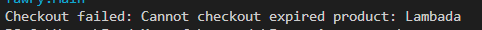
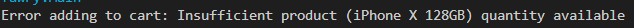
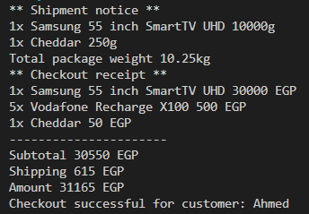
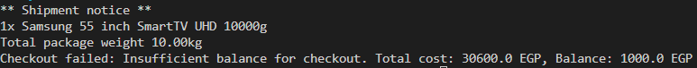
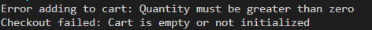
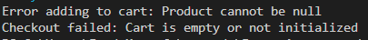
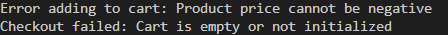

# Fawry Checkout System

A Java-based checkout system for managing products, carts, and shipping, designed with object-oriented principles.

## Assumptions
- **Shipping Fee**: Calculated as 0.06% of the total weight in grams (e.g., 10250g → 0.06 * 10250 = 615 EGP)
- **Currency**: All prices and fees are in EGP (Egyptian Pound). (Note that you can change the currancy variable for checkout)
- **Product Details**:
  - `Cheese`: Name "Cheddar", price 50.0 EGP, quantity 2, weight 250g, expires 2025-12-31.
  - `Biscuit`: Name "Lambada", price 20.0 EGP, quantity 5, weight 100g, expires 2024-11-30 (expired).
  - `Mobile`: Name "iPhone X 128GB", price 15000.0 EGP, quantity 0, weight 350g.
  - `TV`: Name "Samsung 55 inch SmartTV UHD", price 30000.0 EGP, quantity 1, weight 10000g.
  - `MobileScratchCard`: Name "Vodafone Recharge X100", price 100.0 EGP, quantity 10, non-shippable.
- **Expiration**: Checked against `LocalDate.now()` (assumed July 5, 2025).
- **Cart**: Uses `Map<Product, Integer>` to store items and quantities.
- **Exceptions**: Handled with custom messages for invalid inputs, expired products, and insufficient balance.

## Lessons Learned
- **System.out.printf**:
  - Used for precise formatting of console output.
  - Specifiers: `%d` for integers (quantity, cost), `%s` for strings (name, currency), `%.2f` for weights in kilograms.
  - Example: `System.out.printf("%dx %s %d %s%n", quantity, product.name, (int)productCost, currancy)` produces `1x Cheddar 50 EGP`.
- **Interfaces**:
  - `Expirable`: Defines `isExpired()` for products like `Cheese` and `Biscuit`.
  - `Shippable`: Defines `getName()` and `getWeight()` for products like `Cheese` and `TV`.
  - Enables polymorphic behavior (e.g., checking expiration with `instanceof Expirable`).
- **Abstract Classes**:
  - `Product`: Base class with `name`, `price`, `quantity`.
  - `ExpirableProduct`: Extends `Product`, implements `Expirable`, centralizes `isExpired()` logic.
  - Reduces code duplication and supports extensibility.
- **Encapsulation**:
  - Immutable fields (e.g., `name` set in constructor) ensure consistency.
- **Exception Handling**:
  - standard exceptions (`IllegalArgumentException`, `IllegalStateException`) provide clear error messages.
- **File Structure**:
  - Organized into `model`, `service`, and `product` subpackages.
  - `images/` folder at root for documentation images.

## Console Outputs for All Cases
The test code in `Main.java` adds products to a cart and attempts checkout, producing various outputs based on success or exceptions.

### Case 1: Default Execution (Biscuit Expired)
- **Cart**: `1x Cheese`, `2x Biscuits`, `1x TV`, `5x MobileScratchCard`.
- **Output**:

  Checkout failed: Cannot checkout expired product: Lambada
- **Reason**: `Biscuit` expires on 2024-11-30, which is before July 5, 2025.

### Case 2: Add Mobile (Insufficient Quantity)
- **Cart**: Add `1x Mobile` (uncomment `customer.addToCart(mobile, 1);`).
- **Output**:

  Error adding to cart: Insufficient product (iPhone X 128GB) quantity available
- **Reason**: `Mobile` has `quantity = 0`, insufficient for adding 1.

### Case 3: Successful Checkout (Remove Mobile and Biscuit)
- **Cart**: `1x Cheese`, `1x TV`, `5x MobileScratchCard` (remove `Mobile and Biscuit` addition).
- **Output**:

  ** Shipment notice **  1x Cheddar 250g  1x Samsung 55 inch SmartTV UHD 10000g  Total package weight 10.25kg  ** Checkout receipt **  1x Cheddar 50 EGP  1x Samsung 55 inch SmartTV UHD 30000 EGP  5x Vodafone Recharge X100 500 EGP
  Subtotal 30550 EGP  Shipping 615 EGP  Amount 31165 EGP  Checkout successful for customer: Ahmed
- **Reason**: No expired products, sufficient quantities, balance (`100000 > 31165`).

### Case 4: Empty Cart
- **Cart**: Comment out all `addToCart` calls.
- **Output**:

  Checkout failed: Cart is empty or not initialized
- **Reason**: Empty cart triggers `IllegalStateException`.

### Case 5: Insufficient Balance
- **Cart**: `1x Cheese`, `1x TV`, `5x MobileScratchCard`, with `balance = 1000`.
- **Output**:

  ** Shipment notice ** 1x Samsung 55 inch SmartTV UHD 10000g  Total package weight 10.00kg  Checkout failed: Insufficient balance for checkout. Total cost: 30600.0 EGP, Balance: 1000.0 EGP
- **Reason**: `totalCost = 30556 > balance = 1000`.

### Case 6: Invalid Quantity
- **Setup**: Add `customer.addToCart(cheese, 0);`.
- **Output**:

  Error adding to cart: Quantity must be greater than zero
- **Reason**: `quantity <= 0` is invalid.

### Case 7: Null Product
- **Setup**: Add `customer.addToCart(null, 1);`.
- **Output**:

  Error adding to cart: Product cannot be null
- **Reason**: `product == null` is invalid.

### Case 8: Negative Price or Quantity
- **Setup**: Set `Cheese.price = -50.0` or `Cheese.quantity = -1`.
- **Output**:
- For negative price: `Error adding to cart: Product price cannot be negative`
- For negative quantity: `Error adding to cart: Product quantity cannot be negative`
- **Reason**: Invalid `price` or `quantity` detected in `addToCart`.

## Setup Instructions
1. Clone the repository.
2. Ensure Java 8+ is installed.
3. Compile and run `Main.java` to test the checkout system.
